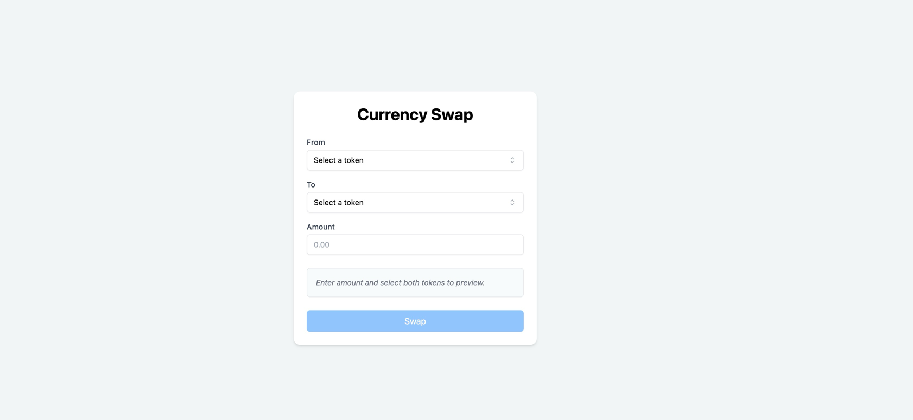
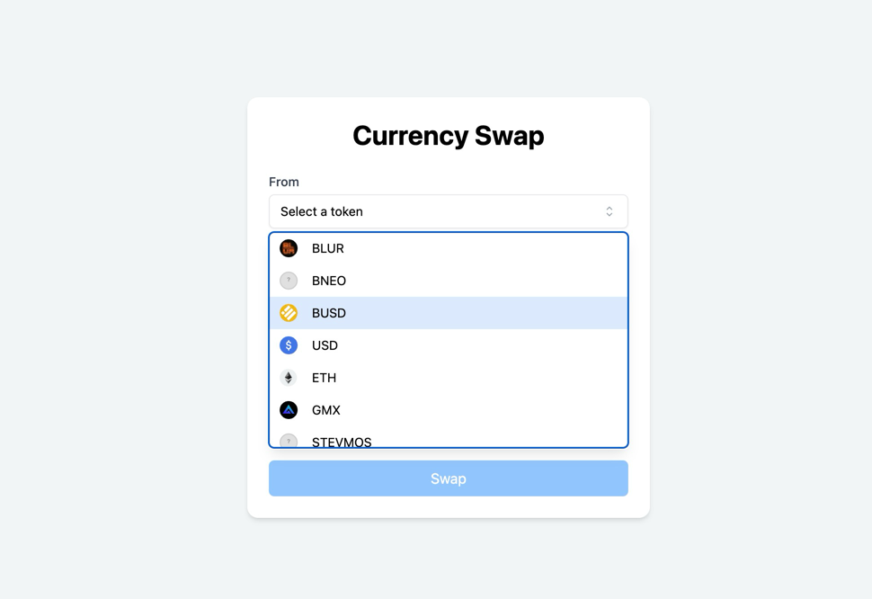
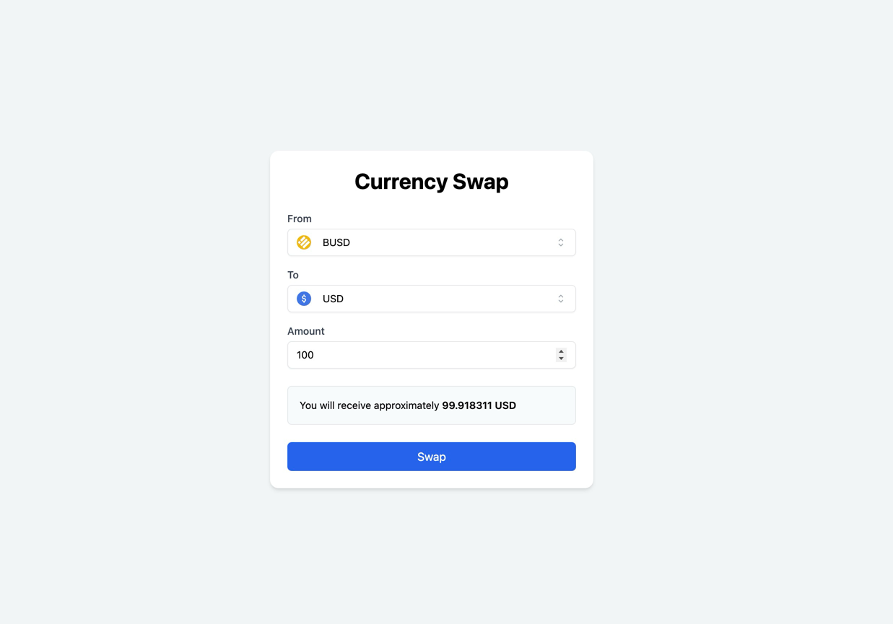
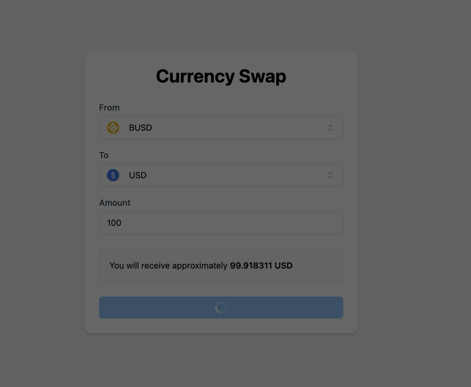
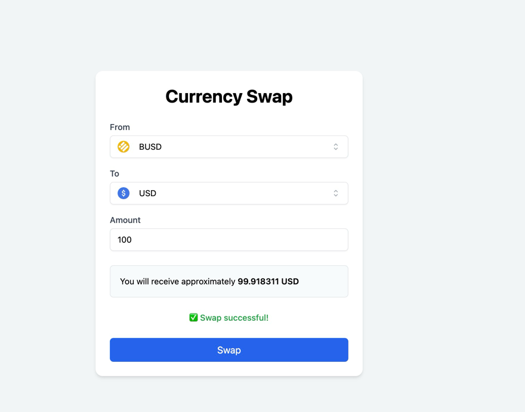

# 💱 Fancy Form - Currency Swap Interface

A modern, minimal and responsive currency swap UI built with **React**, **TailwindCSS**, and **Zustand**, powered by **Nx** monorepo architecture. The project fetches real-time token prices, supports token selection with logos, and calculates swap amounts live.

---

## ✨ Features

- 🔁 Token selection with live filtering and fallback icon support
- 💸 Real-time swap preview with computed price
- 🎯 Zustand-based global state management
- 🌈 Responsive, accessible, TailwindCSS-powered UI
- 🚀 Monorepo setup with Nx for scalable architecture

---

## 🛠 Tech Stack

| Tool         | Description |
|--------------|-------------|
| **React**    | Core UI library |
| **TailwindCSS** | For utility-first styling and rapid prototyping |
| **Zustand**  | Lightweight state management for predictable global state |
| **Headless UI** | Accessible and unstyled UI primitives (e.g., Listbox) |
| **Heroicons** | Icon library used in dropdown UI |
| **Vite**     | Lightning-fast frontend build tool |
| **Nx**       | Monorepo framework for scalable modular development |

### Why Nx?

Nx enables a modular project structure where **shared logic (UI components, utils, store)** can be reused across multiple apps or libraries. It provides:
- Workspace orchestration
- Dependency graph visualization
- Incremental builds & caching
- Custom library generation (e.g., `@fancy-form-nx/ui`, `@fancy-form-nx/store`)

This approach ensures that each part of the application remains maintainable and testable independently.

---

## 🧪 How to Run

```bash
pnpm install
pnpm npx nx serve fancy-form # or pnpm run dev
```

---

## 🧩 Project Structure (Simplified)

```
apps/
  fancy-form/          # Main app
libs/
  containers/swap-form # SwapForm UI container
  shared/
    ui/                # Reusable UI components (TokenSelect, SwapButton, etc.)
    utils/             # fetchTokenPrices, calculation logic
    store/             # Zustand store
```

---

## 🖼 Token Icons

We use `https://github.com/Switcheo/token-icons` as the base URL for logos, with a local fallback SVG for missing tokens to ensure graceful rendering.

---

## 🚧 Known Improvements or TODOs
- Enable search token selection with live filtering
- Virtualized Dropdown for Performance (Best for 100+ tokens)
- Enhance accessibility (aria labels, keyboard focus)
- Add unit and e2e tests
- Persist swap history for user

---
## App Preview     
